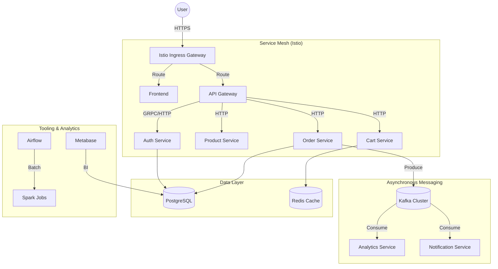
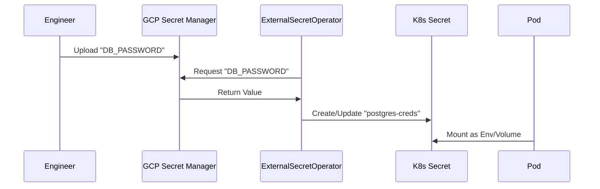

# 📄 GKE SRE Platform Playbook: E-Commerce Microservices

> **Internal Grade Document: Principal DevOps Architect / Staff SRE**
> **Confidential - Engineering Operations**

---

## Phase 0: System Architecture

### 0.1 High-Level Architecture
The platform is built as a cloud-native, distributed microservices system on **Google Kubernetes Engine (GKE)**, leveraging **Istio Service Mesh** for traffic management and **External Secrets Operator (ESO)** for secure credential injection.



### 0.2 Dependency Graph & Blast Radius Analysis

| Service | Primary Dependencies | Impact of Failure (Blast Radius) | Criticality |
| :--- | :--- | :--- | :--- |
| **Auth Service** | PostgreSQL | **System-Wide Blackout**. No users can login or transact. | 🔴 P0 |
| **API Gateway** | Istio, Auth | **Total Ingress Failure**. No external traffic reaches services. | 🔴 P0 |
| **Order Service** | PostgreSQL, Kafka | **Revenue Loss**. Orders cannot be placed; transactional integrity at risk. | 🔴 P1 |
| **Kafka Cluster** | PV Storage | **Event Loss**. Async workflows (Analytics, Notifications) halt. | 🟠 P2 |
| **Metabase** | PostgreSQL | **Insight Delay**. Internal BI dashboards unavailable. No customer impact. | 🟡 P3 |

---

## Phase 1: Prerequisites & Access

Deploying a production cluster requires perfect alignment between GCP APIs, IAM, and local tooling.

### 1.1 GCP API Readiness
**Failure Context**: Terraform fails to create resources because APIs are disabled.
*   **Error**: `Error 403: Compute Engine API has not been used in project...`
*   **Root Cause**: Attempting to provision GKE before enabling `container.googleapis.com`.
*   **Fix**:
    ```bash
    gcloud services enable container.googleapis.com \
        compute.googleapis.com \
        secretmanager.googleapis.com \
        artifactregistry.googleapis.com
    ```
*   **Guardrail**: The `infra/terraform/gcp/project-setup` module MUST include a `google_project_service` resource with `disable_on_destroy = false`.

### 1.2 IAM & Workload Identity
**Failure Context**: External Secrets Operator (ESO) cannot fetch secrets from Secret Manager.
*   **Error**: `permission denied: iam.serviceAccounts.getAccessToken`
*   **Root Cause**: Missing IAM binding between the K8s ServiceAccount and the GCP IAM ServiceAccount.
*   **Detection**: `kubectl describe externalsecret <name> -n <ns>` -> Check Status.
*   **Fix**:
    ```bash
    gcloud iam service-accounts add-iam-policy-binding \
        external-secrets@${PROJECT_ID}.iam.gserviceaccount.com \
        --role roles/iam.workloadIdentityUser \
        --member "serviceAccount:${PROJECT_ID}.svc.id.goog[external-secrets/external-secrets]"
    ```
*   **Guardrail**: Use Terraform to manage these bindings centrally to avoid "snowflake" manual fixes.

---

## Phase 2: Infrastructure Provisioning (Terraform)

### 2.1 State Lock Issues
**Failure Context**: Multiple engineers or CI jobs attempting to apply Terraform simultaneously.
*   **Error**: `Error: Error acquiring the state lock`
*   **Root Cause**: GCS backend lock exists but the process crashed.
*   **Fix**:
    ```bash
    # FORCE UNLOCK (CAUTION: Ensure no other job is running)
    terraform force-unlock <LOCK_ID>
    ```

### 2.2 Quota Exhaustion
**Failure Context**: GKE creation fails halfway through.
*   **Error**: `Quota exceeded for IN_USE_ADDRESSES...`
*   **Detection**: GCP Console -> IAM & Admin -> Quotas.
*   **Prevention**: Request quota increase for `CPUs` and `Static IPs` BEFORE production scale-up.

---

## Phase 3: Cluster Bootstrap

### 3.1 CRD Installation Race Condition
**Failure Context**: Helm charts for applications fail because Istio or ESO CRDs aren't ready.
*   **Symptoms**: `error: unable to recognize "values.yaml": no matches for kind "VirtualService" in version "networking.istio.io/v1beta1"`
*   **Fix**: Sequence bootstrap strictly: Operator/CRDs -> Platform Components -> Applications.
*   **Command**: `kubectl get crd | grep istio` to verify before applying charts.

### 3.2 Webhook Blockage
**Failure Context**: Pods won't start because a MutatingWebhook (like Istio sidecar-injector) is unreachable.
*   **Symptoms**: `Internal error occurred: failed calling webhook "namespace.sidecar-injector.istio.io"`
*   **Recovery**:
    ```bash
    # Temp disable webhook to allow recovery pod to start
    kubectl delete mutatingwebhookconfiguration istio-sidecar-injector
    ```

---

## Phase 4: Secrets & ExternalSecrets (The ESO Pipeline)

ESO is the bridge between GCP Secret Manager and Kubernetes.

### 4.1 Secret Flow Diagram


### 4.2 Deep Debugging ESO
**Incident Case**: Secret exists in GCP but stays "Pending" in K8s.
1.  **Check Store**: `kubectl get clustersecretstore gcp-secret-store` (Should be READY).
2.  **Check ES Status**: `kubectl describe externalsecret <name>`
    *   **Common Error**: `SecretManager.GetSecret: Permanent error: Secret [X] not found.`
    *   **Root Cause**: Typo in the `key` field of the `ExternalSecret` manifest.
3.  **Check IAM**: Ensure SA has `roles/secretmanager.secretAccessor`.

---

## Phase 5: Image Build & Registry (Artifact Registry)

Production stability depends on the registry being reachable and the images being immutable.

### 5.1 ImagePullBackOff Root Causes
**Scenario**: Pod is stuck in `ImagePullBackOff`.
1.  **Wrong Registry Path**:
    *   **Symptom**: `Failed to pull image "gcr.io/prj/service:v1": rpc error: code = NotFound`
    *   **Detection**: `kubectl describe pod <name>`
    *   **Fix**: Verify the fully qualified image name in `values.yaml`.
2.  **Missing Permissions**:
    *   **Symptom**: `failed to authorize: failed to fetch oauth token: 403 Forbidden`
    *   **Root Cause**: GKE node pool service account lacks `roles/artifactregistry.reader`.
    *   **Fix**: `gcloud projects add-iam-policy-binding ${PROJECT_ID} --member=serviceAccount:${NODE_POOL_SA} --role=roles/artifactregistry.reader`

---

## Phase 6: Helm Deployment (Per Service)

### 6.1 Service Failure Modes

| Service | Symptom | Root Cause | Fix |
| :--- | :--- | :--- | :--- |
| **Frontend** | `CrashLoop` | Port Mismatch (80 vs 8080) | Align `servicePort` in Helm |
| **Order Service** | `CrashLoop` | DB Connection Refused | Add `initContainer` with `pg_isready` |
| **Metabase** | `Restarts` | Liveness Probe kills Migrations | Add `startupProbe` (300s+) |

---

## Phase 8: Observability & Alerts

### 8.1 Metrics & Tracing
*   **Issue**: Traces missing service name.
*   **Fix**: Set `OTEL_SERVICE_NAME` env var in Helm values.
*   **Issue**: Prometheus not scraping pod.
*   **Fix**: Ensure labels match `ServiceMonitor` selector.

---

## Phase 9: Production Incidents

### Incident #2026-004: The "Phantom" Metabase Crash
*   **Root Cause**: Liveness probe killing container during long schema migration.
*   **Fixed**: Implementation of `startupProbe` and increased memory limits.

---

## Phase 10: Master Troubleshooting Playbooks

*   **Symptom**: Pod `Pending` -> **Check**: Taints/Tolerations.
*   **Symptom**: `Pod Security Violation` -> **Check**: Namespace labels (Privileged).
*   **Symptom**: `OIDC Auth Error` -> **Check**: GHA Provider Path.

---
