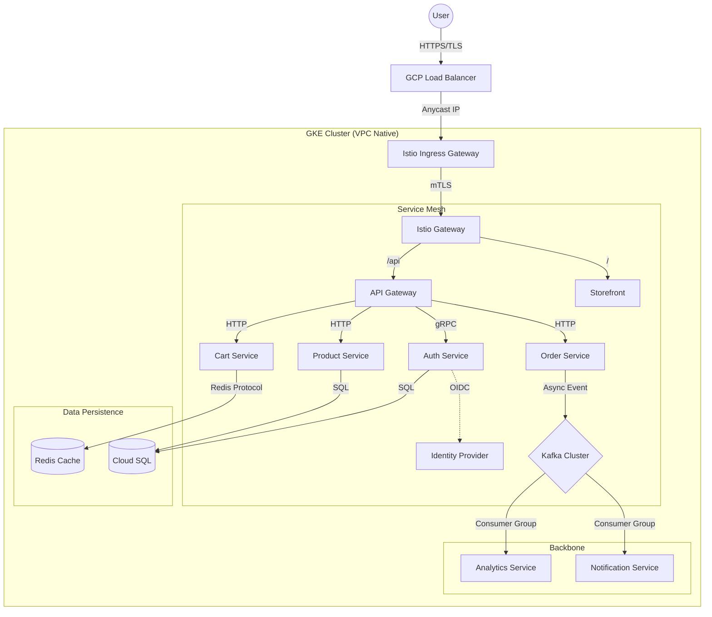

# 🛒 Cloud-Native E-Commerce Platform


> **Enterprise-grade, distributed e-commerce platform built for scale.**
> Designed with a focus on **high availability**, **observability**, and **GitOps principles**. Fully deployable on Google Kubernetes Engine (GKE) or locally via Docker Compose.

---

## 🏗️ Architecture & Design

This system mirrors a real-world production environment, leveraging a microservices architecture orchestrated by Kubernetes and managed via GitOps.

### Traffic Flow & Security



### 📐 Design Principles

1.  **Twelve-Factor App**: All services are stateless, configured via environment variables, and treat backing services as attached resources.
2.  **GitOps First**: All infrastructure and application state is defined in code. Argo CD synchronizes the cluster state with this repository.
3.  **Zero-Trust Security**: service-to-service communication is secured via Istio mTLS. External secrets are injected via ESO (External Secrets Operator) directly from GCP Secret Manager, never stored on disk.
4.  **Golden Signal Observability**: Every service automatically exports Latency, Traffic, Errors, and Saturation metrics to Prometheus.

---

## 📚 SRE Resource Center

For operational guides, disaster recovery, and deep-dive troubleshooting, refer to our internal engineering documentation:

| Document | Description | Target Audience |
| :--- | :--- | :--- |
| [**📘 GKE SRE Platform Playbook**](GKE_SRE_PLATFORM_PLAYBOOK.md) | The "Bible" for this platform. Architecture, disaster recovery, and incident response. | Staff SRE / Principal Engineers |
| [**🔧 Deployment Troubleshooting**](deployment-troubleshooting.md) | Archive of resolved deployment issues and their fixes (Airflow, Loki, Helm). | On-Call Engineers |
| [**🐞 Metabase Deep Dive**](metabase-sre-analysis.md) | Analysis of complex pod scheduling and probe failure scenarios. | DevOps / SRE |
| [**🕸️ Kafka Operations**](kafka-troubleshooting.md) | Guide to Strimzi operator, KRaft mode, and restoring split-brain clusters. | Data Engineers |

---

## 🧩 Microservices

| Service | Port | Protocol | Description | Dependencies |
| :--- | :--- | :--- | :--- | :--- |
| **api-gateway** | `8080` | HTTP | Unified entry point, routing, and aggregation. | Auth, Product, Cart |
| **auth-service** | `50051` | gRPC | User authentication & JWT token generation. | PostgreSQL |
| **product-service** | `50051` | gRPC | Catalog management and inventory tracking. | PostgreSQL |
| **cart-service** | `7070` | HTTP | Shopping cart management. | Redis |
| **offer-service** | `50051` | gRPC | Dynamic pricing and discount engine. | None |
| **analytics-ingest** | `8080` | HTTP | Ingests user behavior events. | Kafka |
| **audit-service** | `--` | Kafka | Compliance logging for all critical actions. | Kafka |

---

## 🚀 Installation & Setup

### 1. Prerequisites (GCP)

Before deploying to GKE, you **MUST** enable the following APIs and prepare your environment.

```bash
# Enable required GCP APIs
gcloud services enable \
    container.googleapis.com \
    compute.googleapis.com \
    secretmanager.googleapis.com \
    artifactregistry.googleapis.com \
    iam.googleapis.com
```

### 2. Bootstrap Identity (Workload Identity)

This platform uses Workload Identity Federation. You must bind the Kubernetes Service Accounts to GCP IAM Service Accounts.

```bash
# Example: Allow External Secrets Operator to read from Secret Manager
gcloud iam service-accounts add-iam-policy-binding \
    external-secrets@${PROJECT_ID}.iam.gserviceaccount.com \
    --role roles/iam.workloadIdentityUser \
    --member "serviceAccount:${PROJECT_ID}.svc.id.goog[external-secrets/external-secrets]"
```

### 3. Deployment Options

#### ☁️ Option A: Production (Terraform + GKE)

1.  **Infrastructure**: `cd infra/terraform && terraform apply`
2.  **GitOps**: `kubectl apply -f argocd/install.yaml`
3.  **Sync**: `kubectl apply -f argocd/applications/app-of-apps.yaml`

#### 💻 Option B: Local Development (Docker Compose)

Run the platform locally for testing.

```bash
docker-compose up -d --build
```
> **Note**: Local development uses standard Kafka and local Postgres. It does not replicate GKE networking or IAM policies.

---

## 📊 Observability

Accurate observability is critical for SRE operations. Access the dashboards via port-forwarding:

| Tool | URL | Credentials | Purpose |
| :--- | :--- | :--- | :--- |
| **Grafana** | `localhost:3000` | `admin`/`admin` | Metrics & Dashboards |
| **Prometheus** | `localhost:9090` | None | Raw Metrics Query |
| **Jaeger** | `localhost:16686` | None | Distributed Tracing |
| **Kiali** | `localhost:20001` | `admin`/`admin` | Mesh Visualization |

---

## 📄 License

This project is licensed under the MIT License - see the [LICENSE](LICENSE) file for details.
