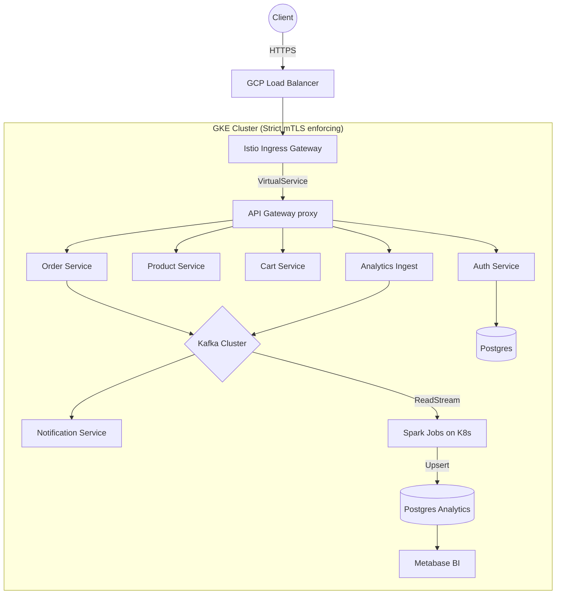

# 🛒 Enterprise Cloud-Native E-Commerce Platform Base

**Classification:** Internal Platform Engineering Documentation  
**Tier:** 1 (Mission Critical)  
**Owners:** `@platform-engineering`, `@data-engineering`, `@sre-core`

---

## 📖 Platform Overview
This repository contains the declarative state for the Enterprise E-Commerce Platform. It unifies Application Engineering (18 independent Go microservices), Cloud Infrastructure (Terraform/GKE), Data Engineering (Kafka/Spark Structured Streaming), and Security (Global mTLS, ExternalSecrets) under a strict GitOps methodology managed by ArgoCD.

> [!WARNING]
> **Strict GitOps Enforcement:** Modifying Kubernetes resources manually via `kubectl apply` or `helm upgrade` in the production cluster is a violation of policy. All changes must be committed to this repository. ArgoCD (`selfHeal: true`) will aggressively overwrite manual drift.

---

## 🏛️ Architecture & Traffic Flow
The platform is built on Google Kubernetes Engine (GKE) and enforcing Zero-Trust networking via Istio.



---

## 🔐 1. Secret Management (External Secrets Flow)

We do not store `.env` files or base64 `Secret` manifests in git. Secrets are mastered in **Google Secret Manager (GSM)** and synchronized dynamically into GKE memory via the External Secrets Operator (ESO).

**Sync Flow:** `GSM` → `Workload Identity` → `ClusterSecretStore` → `ExternalSecret` → `Native K8s Secret`

### Creating a New Secret
Before deploying a service that requires a secret, you must provision it in GCP:
```bash
# Example: Adding a new DB password for cart-service
gcloud secrets create cart-db-password --replication-policy="automatic"
echo -n "super-secure-password" | gcloud secrets versions add cart-db-password --data-file=-
```

> [!IMPORTANT]
> **Dependency Block:** If an `ExternalSecret` requests a GSM key that does not exist, the operator will block the creation of the native K8s `Secret`. Subsequently, the dependent Deployment Pods will fail to start (`CreateContainerConfigError`).

**Verify Synchronization:**
```bash
# Verify the ESO has pulled the secret successfully
kubectl get externalsecrets -A | grep True
```

---

## 🚀 2. Infrastructure Initialization (Terraform)

Infrastructure MUST be provisioned sequentially. 

### Step 2.1: Bootstrap GCP & IAM
Enable required APIs and initialize the remote state bucket.
```bash
cd infra/terraform/gcp/bootstrap-backend
terraform init && terraform apply -auto-approve

cd ../bootstrap-identity
terraform init && terraform apply -auto-approve
```

### Step 2.2: Compute & Service Mesh Initialization
Provision GKE, Node Pools, and Workload Identity bindings.
```bash
cd ../gke
terraform init && terraform apply -auto-approve

# Authenticate local context
gcloud container clusters get-credentials ecommerce-platform-prod --region us-central1
```

---

## 🔄 3. CI/CD & Image Immutability

Docker images are built via Google Cloud Build (or GitHub Actions). We strictly enforce **immutable image tags** tying deployments back to exact `git.sha` references.

1. Commits trigger `.github/workflows/ci.yml`.
2. Services are built (distroless) and pushed to `us-central1-docker.pkg.dev` with the Git SHA tag.
3. ArgoCD Image Updater (or Kustomize PRs) detects the new SHA and patches the manifest.
4. ArgoCD orchestrates a Rollout (Canary) deployment.

> [!CAUTION]
> Utilizing `:latest` tags is explicitly banned to prevent non-deterministic rollbacks.

---

## 📦 4. Kubernetes & GitOps Bootstrapping (ArgoCD)

Once the GKE cluster is available, hand over deployment execution to ArgoCD. The "App of Apps" pattern manages dependency ordering.

### Step 4.1: Install ArgoCD
```bash
kubectl create namespace argocd
kubectl apply -n argocd -f https://raw.githubusercontent.com/argoproj/argo-cd/v2.10.4/manifests/install.yaml
```

### Step 4.2: Apply Base Dependencies (Manual)
Service Mesh and Secrets Operators must exist before stateful apps.
```bash
# 1. Namespaces (Initializes Istio injection labels and PodSecurityStandards)
kubectl apply -f infra/namespaces/

# 2. Istio Mesh (Sets up mTLS STRICT and Default-Deny Authorization Policies)
istioctl install --set profile=default -y
kubectl apply -f infra/istio/security/

# 3. External Secrets (Requires Workload Identity from TF Step 2.1)
helm upgrade --install external-secrets external-secrets/external-secrets -n external-secrets --wait
kubectl apply -f infra/secrets/external-secrets.yaml
```

### Step 4.3: Execute GitOps Sync
Apply the Root Application. This will deterministically sync Databases → Kafka → Observability → Data Pipeline → Microservices.
```bash
kubectl apply -f argocd/root/application.yaml
```

---

## 📊 5. Data Pipeline (ELT) & Analytics

The ELT pipeline handles transactional analytics asynchronously without impacting the hot path.

**Data Flow:** `Order Service` → `Kafka` → `Spark Structured Streaming` → `Postgres` → `Metabase`

1. **Spark Operator:** Orchestrates PySpark jobs inside the cluster.
2. **Exactly-Once Semantics:** `funnel_analysis.py` uses `readStream` reading from the `page.viewed` topic, leveraging GCS checkpointing (`CHECKPOINT_PATH`) to guarantee no data loss on pod eviction.
3. **Database Idempotency:** The Spark Py4j JDBC writer executes native Postgres `UPSERT (ON CONFLICT DO UPDATE)` commands locking records safely.

### Monitoring Streaming Jobs
```bash
# Inspect the spark driver processing loop
kubectl logs -f spark-funnel-analysis-driver -n data
```

---

## ⚙️ 6. Operations & Observability 

All applications are natively instrumented with OpenTelemetry (`shared-lib/pkg/tracing`) propagating W3C context headers.

### Common SRE Commands

**Debugging Traffic Routing (Istio):**
```bash
# Check if a VirtualService is rejecting your route
istioctl proxy-status
istioctl analyze -n ecommerce
```

**Validating HPA / Scaling:**
```bash
# Confirm metrics server is feeding resource utilization properly
kubectl get hpa -A
```

**Verifying Kafka Consumer Lag:**
```bash
# Ensure consumers aren't falling behind producer ingestion rates
kubectl exec -it my-kafka-cluster-kafka-0 -n kafka -- bin/kafka-consumer-groups.sh --bootstrap-server localhost:9092 --describe --group notification-group
```

**Inspecting Application Logs (Structured):**
```bash
# Search for specific trace IDs across the cart-service
kubectl logs -l app=cart-service -n apps-core | grep '"trace_id":"xyz123"'
```

---

## 🏁 7. Verification Checklist
A deployment is only finalized when all of the following conditions report healthy:

* [ ] `kubectl get externalsecrets -A` (All True/Synced)
* [ ] `kubectl get hpa -A` (All Targets registering % utilization, no `<unknown>`)
* [ ] `kubectl get pods -n istio-system` (Ingress Gateway Running)
* [ ] Grafana Dashboards confirm 99% API Latency SLO `< 500ms`.
