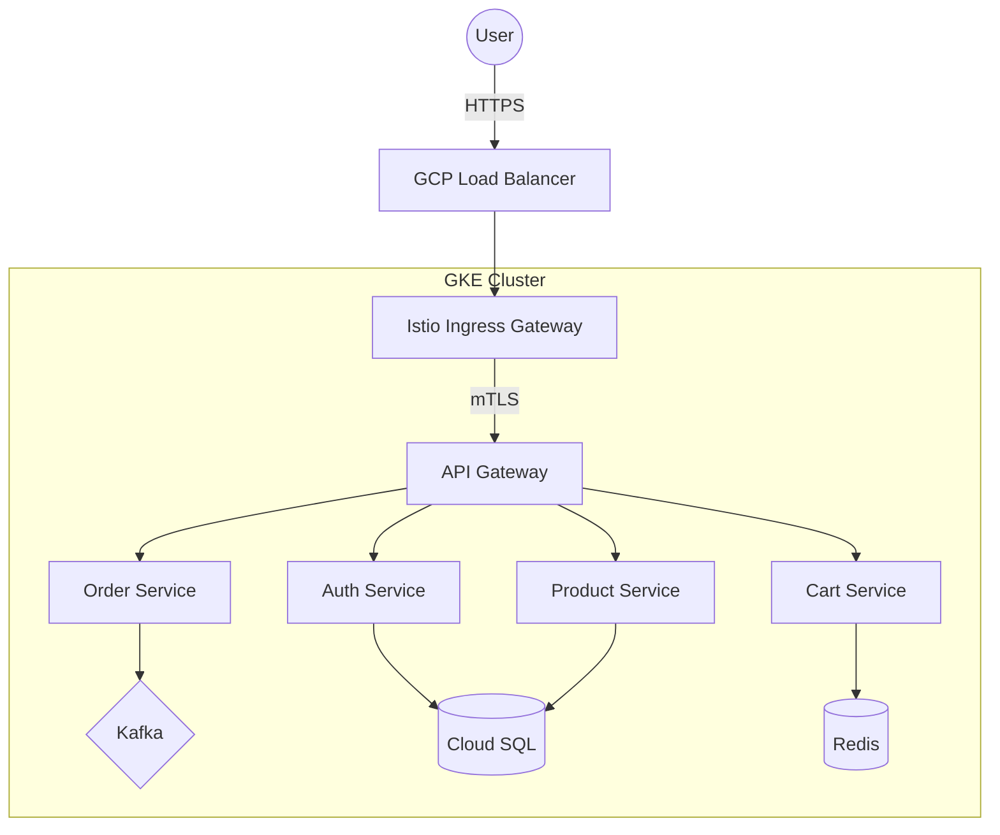

# 🛒 Cloud-Native E-Commerce Platform  
### Production-Grade Microservices on GKE with Terraform, GitOps & Service Mesh


---

## 🎯 Executive Summary

This project simulates a real-world enterprise e-commerce platform engineered using modern cloud-native and SRE best practices.

It demonstrates:

- Infrastructure as Code (Terraform)
- GitOps-driven continuous delivery (Argo CD)
- Zero-trust service mesh security (Istio mTLS)
- Event-driven distributed systems (Kafka)
- Golden Signal observability (Prometheus, Grafana, Tempo, Loki)
- Production-grade Kubernetes operations on GKE

This repository reflects platform engineering ownership — not just application deployment.

---

# 🗺️ Architecture Overview

## Traffic Flow



---

# 🧠 Architectural Principles

- Twelve-Factor App compliant
- Declarative GitOps-driven deployments
- Zero-trust internal traffic (mTLS)
- Secrets managed via GCP Secret Manager
- Observability-first design
- Independent microservice scaling
- Event-driven backbone via Kafka

---

# 🚀 Full Production Deployment Guide (GKE)

## 🛠️ Prerequisites

### Required Tools

- gcloud
- terraform
- kubectl
- helm
- istioctl

### Required Access

- GCP Project Owner or Editor role

---

# 1️⃣ Infrastructure Provisioning (Terraform)

Navigate to:

```
infra/terraform/gcp
```

## 1.1 Bootstrap Identity & Backend

```bash
cd bootstrap-identity
terraform init
terraform apply -var="project_id=<YOUR_PROJECT_ID>"
```

This sets up:

- Workload Identity Federation
- GCS Terraform backend
- IAM bindings for External Secrets

---

## 1.2 Provision Secrets Manager

```bash
cd ../secrets
terraform apply
```

---

## 1.3 Provision GKE Cluster

```bash
cd ../gke
terraform apply
```

---

# 2️⃣ Connect to Cluster

```bash
gcloud container clusters get-credentials ecommerce-cluster --region <REGION>
```

---

# 3️⃣ Base Platform Services

## 3.1 External Secrets Operator

```bash
helm repo add external-secrets https://charts.external-secrets.io
helm install external-secrets external-secrets/external-secrets \
    -n external-secrets --create-namespace \
    --set installCRDs=true
```

Apply ClusterSecretStore:

```bash
kubectl apply -f infra/external-secrets/cluster-secret-store.yaml
```

---

## 3.2 Kafka (Strimzi Operator)

```bash
kubectl create namespace kafka
kubectl apply -f infra/kafka/operator/strimzi-install.yaml
kubectl apply -f infra/kafka/cluster/kafka.yaml
```

Kafka runs in KRaft mode.

---

# 4️⃣ Databases

## PostgreSQL

```bash
helm install postgres bitnami/postgresql \
    -n data-postgres --create-namespace \
    -f infra/databases/postgres/values.yaml \
    --set metrics.serviceMonitor.enabled=false
```

## Redis

```bash
helm install redis bitnami/redis \
    -n data-redis --create-namespace \
    -f infra/databases/redis/values.yaml \
    --set metrics.serviceMonitor.enabled=false
```

---

# 5️⃣ Deploy Microservices

## Sync Secrets First

```bash
kubectl apply -f infra/secrets/
kubectl apply -f infra/app-secrets/
```

## Deploy Services

Example:

```bash
helm upgrade --install auth-service services/auth-service/helm \
    -n apps-core --create-namespace \
    -f services/auth-service/helm/values.yaml
```

Repeat for:

- product-service
- cart-service
- order-service
- api-gateway
- analytics services

---

# 6️⃣ Install Istio Service Mesh

## Control Plane

```bash
istioctl install --set profile=minimal -y
```

## Ingress Gateway

```bash
kubectl apply -f infra/istio/gateway-workload/
```

## Routing Configuration

```bash
kubectl apply -f infra/istio/ingress/
kubectl apply -f infra/istio/ingress/virtual-services/
```

---

# 7️⃣ Observability Stack

## Add Helm Repos

```bash
helm repo add prometheus-community https://prometheus-community.github.io/helm-charts
helm repo add grafana https://grafana.github.io/helm-charts
helm repo update
```

---

## Deploy Monitoring Components

### Prometheus

```bash
helm upgrade --install prometheus prometheus-community/prometheus \
    -n platform-observability --create-namespace \
    -f infra/observability/prometheus/values.yaml
```

### Loki (Logs)

```bash
helm upgrade --install loki grafana/loki \
    -n platform-observability \
    -f infra/observability/loki/values.yaml
```

### Tempo (Tracing)

```bash
helm upgrade --install tempo grafana/tempo \
    -n platform-observability \
    -f infra/observability/tempo/values.yaml
```

### Grafana

```bash
helm upgrade --install grafana grafana/grafana \
    -n platform-observability \
    -f infra/observability/grafana/values.yaml
```

---

# ✅ Verification

Check all pods:

```bash
kubectl get pods -A
```

All services should be `Running`.

Get public ingress IP:

```bash
kubectl get svc -n istio-system istio-ingressgateway
```

Test endpoints:

- http://<IP>/
- http://<IP>/api-gateway/health
- http://<IP>/product

---

# 🧩 Known Active Remediation Cases

### Metabase
- Slow initialization due to DB migrations
- Uses startupProbes and tolerations
- Wait ~10 minutes for stabilization

### Spark Job
- Operator namespace scoping issue
- Requires patching deployment to watch all namespaces

---

# 💻 Local Development

```bash
docker-compose up -d --build
```

Includes:

- Kafka
- PostgreSQL
- Redis
- All services

Note: Local environment does not replicate IAM or mesh-level security.

---

# 📈 Scalability & Reliability Features

- Horizontal Pod Autoscaling
- Rolling deployments
- Circuit breaking (Istio)
- Event partition scaling
- Health probes
- Distributed tracing
- Metrics-based monitoring

---

# 🔐 Security Model

- Istio mTLS encryption
- IAM Workload Identity
- No static secrets in repo
- Namespace isolation
- Least privilege IAM

---

# 🎯 What This Project Demonstrates

- End-to-end platform ownership
- Secure cloud-native architecture
- GitOps-driven continuous delivery
- Distributed event-driven design
- SRE-grade observability
- Infrastructure automation at scale

---

# 📄 License

MIT License — see LICENSE file.
