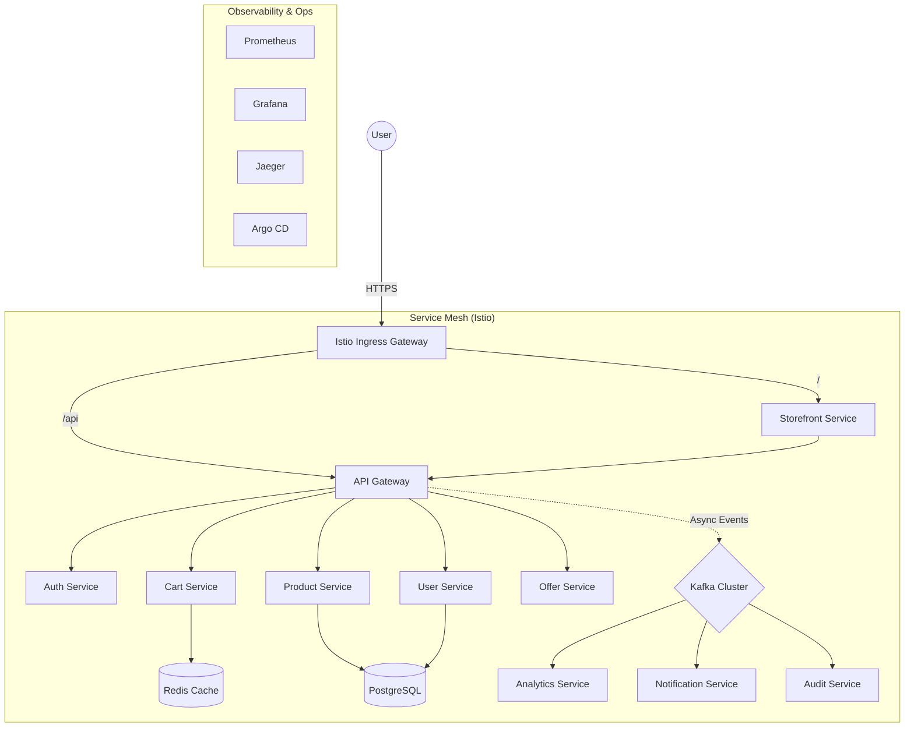

# 🛒 Cloud-Native E-Commerce Platform


> **Enterprise-grade, distributed e-commerce platform built for scale.**
> Designed with a focus on **high availability**, **observability**, and **GitOps principles**. Fully deployable on Google Kubernetes Engine (GKE) or locally via Docker Compose.

---

## 🏗️ Architecture

This system mirrors a real-world production environment, leveraging a microservices architecture orchestrated by Kubernetes and managed via GitOps.



### 🌟 Key Features

-   **Cloud-Native**: Native integration with GKE, Cloud SQL, and Google Secret Manager.
-   **Service Mesh**: Istio for mTLS, traffic splitting, and observability.
-   **GitOps**: Argo CD for declarative continuous delivery.
-   **Event-Driven**: Kafka (KRaft mode) for asynchronous communication and analytics.
-   **Observability**: Full OpenTelemetry stack (Prometheus, Grafana, Jaeger, Loki, Tempo).
-   **Security**: OIDC Authentication, RBAC, and Network Policies.

---

## 🧩 Microservices

| Service                  | Description                                      | Tech Stack |
| ------------------------ | ------------------------------------------------ | ---------- |
| **api-gateway**          | Unified entry point, routing, and aggregation.   | Go, Fiber  |
| **auth-service**         | User authentication & JWT token generation.      | Go, OAuth2 |
| **product-service**      | Catalog management and inventory tracking.       | Go, gRPC   |
| **cart-service**         | Shopping cart management with Redis persistence. | Go, Redis  |
| **user-service**         | User profile and preferences management.         | Go, SQL    |
| **offer-service**        | Dynamic pricing and discount engine.             | Go         |
| **storefront-service**   | Server-side rendered frontend UI.                | Go, HTML   |
| **analytics-ingest**     | Ingests user behavior events into data pipeline. | Go, Kafka  |
| **notification-service** | Sends emails/SMS based on Kafka events.          | Go         |
| **audit-service**        | Compliance logging for all critical actions.     | Go         |
| **admin-backoffice**     | Internal admin dashboard for managing platform.  | Go, React  |

---

## 🚀 Installation & Setup

### prerequisites

Ensure you have the following installed:

-   [Go 1.22+](https://go.dev/dl/)
-   [Docker & Docker Compose](https://www.docker.com/)
-   [Terraform 1.6+](https://developer.hashicorp.com/terraform/install)
-   [kubectl](https://kubernetes.io/docs/tasks/tools/)
-   [Google Cloud SDK](https://cloud.google.com/sdk/docs/install)

### 💻 Option 1: Local Development (Docker Compose)

Run the supporting infrastructure locally for development. Note that this starts the data and observability layers; microservices should be run individually using Go or your IDE.

1.  **Clone the repository:**
    ```bash
    git clone https://github.com/Moiz-Ali-Moomin/microservice-ecommerce-gcp-cloud-gke-setup.git
    cd ecommerce-platform
    ```

2.  **Start Infrastructure (Postgres, Redis, Kafka, Observability):**
    ```bash
    docker-compose up -d
    ```

3.  **Run Services:**
    You can run individual services using `go run`. For example:
    ```bash
    cd services/storefront-service
    go run main.go
    ```

4.  **Access Infrastructure:**
    -   **Grafana**: [http://localhost:3000](http://localhost:3000) (admin/admin)
    -   **Jaeger**: [http://localhost:16686](http://localhost:16686)
    -   **Kafka UI** (if configured): [http://localhost:8080](http://localhost:8080)

### ☁️ Option 2: Production Deployment (GKE/Terraform)

Deploy to Google Cloud using Terraform and GitOps.

1.  **Initialize Infrastructure:**
    ```bash
    cd infra/terraform
    terraform init
    terraform apply -var="project_id=YOUR_PROJECT_ID"
    ```

2.  **Connect to Cluster:**
    ```bash
    gcloud container clusters get-credentials main-cluster --region us-central1
    ```

3.  **Install Argo CD:**
    ```bash
    kubectl apply -n argocd -f https://raw.githubusercontent.com/argoproj/argo-cd/stable/manifests/install.yaml
    ```

4.  **Sync Applications:**
    Apply the App of Apps pattern to deploy all microservices.
    ```bash
    kubectl apply -f argocd/applications/app-of-apps.yaml
    ```

---

## 🛠️ Development & Contributing

### Running Tests
We use standard Go testing. To run unit tests across all services:

```bash
make test
```

### Building Images
To build Docker images for all services:

```bash
make docker-build
```

### Linting
Ensure code quality before committing:

```bash
make lint
```

---

## 📊 Observability

The platform comes with a pre-configured observability stack.

-   **Grafana**: Metrics visualization and dashboards.
-   **Prometheus**: Metrics collection.
-   **Loki**: Log aggregation.
-   **Tempo**: Distributed tracing.
-   **Kiali**: Service mesh visualization.

---

## 📄 License

This project is licensed under the MIT License - see the [LICENSE](LICENSE) file for details.
