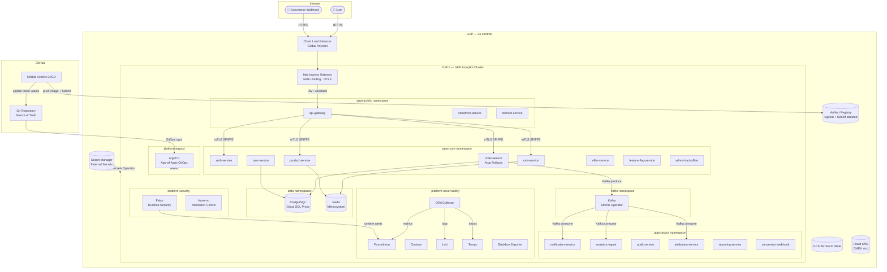

# Ecommerce Platform — GKE Microservices

> **Production-grade, multi-cell ecommerce platform** running on GKE Autopilot. Built to handle **10M+ concurrent users** across isolated failure domains. Every layer — from network to runtime — is designed, not assumed.

[](https://github.com/Moiz-Ali-Moomin/microservice-ecommerce-gcp-cloud-gke-setup/actions/workflows/ci.yml)

---

## Architecture

The platform is built around four principles: **cell-based isolation**, **zero-trust networking**, **GitOps delivery**, and **observable-by-default instrumentation**.


```mermaid
graph TB
    subgraph Internet
        User([👤 User])
        Webhook([🔗 Conversion Webhook])
    end

    subgraph GCP["GCP — us-central1"]
        GCLB[Cloud Load Balancer\nGlobal Anycast]

        subgraph Cell1["Cell 1 — GKE Autopilot Cluster"]
            IGW[Istio Ingress Gateway\nRate Limiting · mTLS]

            subgraph apps_public["apps-public namespace"]
                AGW[api-gateway]
                SF[storefront-service]
                RS[redirect-service]
            end

            subgraph apps_core["apps-core namespace"]
                AUTH[auth-service]
                USER[user-service]
                PROD[product-service]
                CART[cart-service]
                ORDER[order-service\nArgo Rollouts]
                OFFER[offer-service]
                FLAG[feature-flag-service]
                ADMIN[admin-backoffice]
            end

            subgraph apps_async["apps-async namespace"]
                NOTIF[notification-service]
                ANALYTICS[analytics-ingest]
                AUDIT[audit-service]
                ATTR[attribution-service]
                RPT[reporting-service]
                CWH[conversion-webhook]
            end

            subgraph data["data namespaces"]
                PG[(PostgreSQL\nCloud SQL Proxy)]
                RD[(Redis\nMemorystore)]
            end

            subgraph kafka_ns["kafka namespace"]
                KF[Kafka\nStrimzi Operator]
            end

            subgraph observability["platform-observability"]
                PROM[Prometheus]
                GRAF[Grafana]
                LOKI[Loki]
                TEMPO[Tempo]
                OTEL[OTel Collector]
                BB[Blackbox Exporter]
            end

            subgraph security_ns["platform-security"]
                FALCO[Falco\nRuntime Security]
                KYV[Kyverno\nAdmission Control]
            end

            subgraph argocd_ns["platform-argocd"]
                ARGO[ArgoCD\nApp-of-Apps GitOps]
            end
        end

        GCS[(GCS Terraform State)]
        GAR[(Artifact Registry\nSigned + SBOM attested)]
        SM[(Secret Manager\nExternal Secrets)]
        KMS[(Cloud KMS\nCMEK etcd)]
    end

    subgraph GitHub["GitHub"]
        GHA[GitHub Actions CI/CD]
        REPO[Git Repository\nSource of Truth]
    end

    User -->|HTTPS| GCLB
    Webhook -->|HTTPS| GCLB
    GCLB --> IGW
    IGW -->|JWT validated| AGW
    AGW -->|mTLS SPIFFE| AUTH
    AGW -->|mTLS SPIFFE| PROD
    AGW -->|mTLS SPIFFE| CART
    AGW -->|mTLS SPIFFE| ORDER
    ORDER -->|Kafka produce| KF
    KF -->|Kafka consume| NOTIF
    KF -->|Kafka consume| ANALYTICS
    KF -->|Kafka consume| ATTR
    ORDER --> PG
    USER --> PG
    CART --> RD
    PROD --> RD
    GHA -->|push image + SBOM| GAR
    GHA -->|update Helm values| REPO
    REPO -->|GitOps sync| ARGO
    ARGO -->|deploy| Cell1
    SM -->|External Secrets Operator| Cell1
    OTEL -->|traces| TEMPO
    OTEL -->|metrics| PROM
    OTEL -->|logs| LOKI
    FALCO -->|runtime alerts| PROM
```

---

## Request Flow: User Checkout

End-to-end path for the most critical user journey:

```
User → Cloud LB (anycast, TLS termination)
     → Istio Ingress Gateway
         [Rate limit: 5000 rps global, 500 rps/tenant]
         [JWT verification via envoy.filters.http.jwt_authn]
     → api-gateway (apps-public)
         [Propagates: traceparent, x-request-id, x-b3-* headers]
     → auth-service (mTLS SPIFFE: apps-public/sa/api-gateway-sa)
         [Validates JWT, returns user claims]
     → cart-service (mTLS SPIFFE)
         [Reads cart from Redis, validates inventory against product-service]
     → order-service (mTLS SPIFFE)
         [Writes order to PostgreSQL (ACID transaction)]
         [Publishes `order.placed` event → Kafka topic]
     → Kafka (Strimzi)
         [notification-service consumes → email/push]
         [analytics-ingest-service consumes → ClickHouse]
         [attribution-service consumes → campaign attribution]
→ 200 OK returned to user (< 200ms p50 target)
```

**Trace propagation:** Every hop injects and forwards `traceparent` (W3C Trace Context). OTel Collector enriches spans with `k8s.pod.name`, `k8s.namespace.name`, `k8s.deployment.name`. Complete end-to-end traces visible in Grafana Tempo with zero sampling loss at < 1M rps.

---

## Zero Trust Security Model

> **Principle:** No service trusts any other by default. Trust is earned via cryptographic identity, not network location.

### Layers
| Layer | Mechanism | What it enforces |
|-------|-----------|-----------------|
| **L3/L4** | Kubernetes NetworkPolicy | Pod-to-pod IP firewall at kernel level |
| **L7 mTLS** | Istio PeerAuthentication (STRICT mesh-wide) | All inter-service traffic encrypted; plaintext rejected |
| **Identity** | SPIFFE/SVID via Istio Citadel | Each workload gets a cryptographic identity tied to its Service Account |
| **AuthZ** | Istio AuthorizationPolicy per-service | `auth-service` only accepts calls from `api-gateway-sa`; zero namespace-level trust |
| **Admission** | Kyverno ClusterPolicies | Block privileged containers, enforce resource limits, require image signatures |
| **Image integrity** | Cosign keyless + Binary Authorization | Only images signed by the CI pipeline OIDC identity can run |
| **Runtime** | Falco eBPF | Alerts on shell spawn, unexpected syscalls, kubectl exec into prod pods |
| **Secrets** | External Secrets + GCP Secret Manager | Zero secrets in Git; all rotated centrally |
| **etcd** | CMEK (Cloud KMS) | Encryption at rest with customer-managed key |

### Why SPIFFE over namespace trust?
Namespace-level `AuthorizationPolicy` (`namespaces: ["apps-core"]`) is a common shortcut that creates implicit trust for every pod in that namespace. A compromised `feature-flag-service` could call `order-service`. SPIFFE principal pinning (`cluster.local/ns/apps-core/sa/cart-service-sa`) means the compromise is contained — only `cart-service` can call `order-service`.

---

## Reliability & Resilience

### Failure Scenarios

| Scenario | Detection | Response | RTO |
|----------|-----------|----------|-----|
| Single pod crash | Liveness probe failure → K8s restarts pod | PDB prevents full eviction; HPA maintains replica count | < 30s |
| Service overload (>85% CPU) | HPA CPU metric | Auto-scale out; pause-pod buffer pre-warms node | < 90s |
| Downstream timeout | Istio outlier detection (5× 5xx in 10s) | Circuit-breaker ejects host for 30s; retry hits healthy replica | < 1s |
| Kafka broker restart | Consumer group rebalance | Strimzi rolls broker with PDB; consumers pause and resume | < 60s |
| Database connection pool exhaustion | PgBouncer pool metrics alert | Envoy connection pool limit + alert fires; manual scale DB | < 5m |
| Canary regression | Argo Rollouts AnalysisTemplate | Prometheus gates fail → automatic rollback to stable | < 15m |
| Regional GCP outage | Cloud LB health checks | Multi-cell design: traffic shifts to cell-2 (manual trigger) | < 5m manual |
| Runtime intrusion (shell exec) | Falco eBPF kernel probe | Alert to PagerDuty + Slack; correlate with audit log trace | Real-time |

### Retry & Timeout Budget

```
Global defaults (EnvoyFilter):
  timeout:    30s   # Hard upper bound on every HTTP request
  attempts:   3
  perTry:     8s
  retryOn:    connect-failure, refused-stream, 503, 429

order-service (per-service override):
  timeout:    15s   # Tighter because it touches PostgreSQL
  attempts:   3
  perTry:     4s
```

**Retry budget math:** With 3 retries at 8s each + 30s global timeout, a request is guaranteed to resolve (success or failure) within 30s. The circuit-breaker fires at 5 consecutive 5xx in 10s, ejecting the failing host *before* retries saturate the call graph.

---

## Scaling Strategy

### Traffic Shaping (10M Users)

```
10M users → ~500k concurrent connections (assume 50 avg sessions)
→ ~50k rps to ingress (100 rps/session avg)
→ Cell architecture: each cell handles 500k users max
→ At 10M users → 20 cells across 3+ GCP regions
```

### HPA Configuration
| Service | Min | Max | Scale Trigger |
|---------|-----|-----|--------------|
| api-gateway | 3 | 50 | CPU 60% |
| auth-service | 3 | 30 | CPU 70% |
| order-service | 5 | 40 | CPU 65% |
| product-service | 3 | 60 | CPU 60% |
| cart-service | 3 | 40 | CPU 65% |

### Node Pool Strategy (GKE Autopilot)
GKE Autopilot manages node provisioning automatically. For Standard clusters:
- **On-demand nodes:** Control plane + stateful workloads (Kafka, DBs)
- **Spot nodes (70% cheaper):** Stateless app services with PDB preventing total eviction
- **Pause pod buffer:** Pre-allocates ~10% node capacity to eliminate cold-start latency on scale events

---

## Observability

### Signal Coverage
| Signal | Tool | Coverage |
|--------|------|----------|
| **Metrics** | Prometheus + Managed GMP | All services: RED (Rate/Errors/Duration) + USE (Utilization/Saturation/Errors) |
| **Traces** | OTel → Tempo | Full distributed traces with W3C Trace Context propagated through all 15 services |
| **Logs** | Loki + Cloud Logging | Structured JSON logs with `trace_id` correlated across services |
| **Synthetic** | Blackbox Exporter | External HTTP probes on all public endpoints every 30s |
| **Runtime** | Falco | Kernel-level syscall monitoring via eBPF |

### SLO Burn Rate Alerts
Instead of static thresholds, alerts fire based on **error budget consumption rate**:

```
Fast-burn (page immediately):
  Error rate > 14.4× budget threshold over 1h window
  → Monthly SLO (99.9%) burned in < 5 days → wake someone up

Slow-burn (create ticket):
  Error rate > 6× budget threshold over 6h window
  → Monthly SLO burned in < 2 weeks → schedule remediation
```

---

## CI/CD Pipeline

```
Push to main branch
  │
  ├─ [parallel] Tests + Coverage ≥ 80%
  ├─ [parallel] Trivy FS Scan (CRITICAL/HIGH → block)
  ├─ [parallel] SonarQube code quality gate
  │
  ▼
  Compile all services
  │
  ▼ (infra changes only)
  Terraform plan → Terraform apply (staging)
  │
  ▼
  For each changed service:
    docker buildx build (layer-cached via GHA cache)
    cosign sign --yes (keyless OIDC attestation)
    syft <image> -o spdx-json → cosign attest (SBOM on OCI)
    trivy image scan (CRITICAL → block)
  │
  ▼
  Update Helm values (image tag → git commit)
  ArgoCD auto-syncs staging cluster
  │
  ▼ (manual approval gate: "prod" GitHub environment)
  kubectl annotate argocd application --all refresh=hard
  ArgoCD syncs prod cluster
  Argo Rollouts: 5% → 20% → 50% → 100%
    (each step gated by AnalysisTemplate Prometheus checks)
```

### Supply Chain Security
Every production image has three verifiable properties:
1. **Signature:** `cosign verify <image>` — signed by GitHub Actions OIDC, not a developer key
2. **SBOM:** `cosign verify-attestation --type spdxjson <image>` — full dependency graph
3. **Scan:** Trivy results in GitHub Security tab (SARIF upload)

---

## Developer Experience

### One-Command Local Bootstrap

```bash
# Clone and start core services with live-reload
git clone https://github.com/Moiz-Ali-Moomin/microservice-ecommerce-gcp-cloud-gke-setup
cd microservice-ecommerce-gcp-cloud-gke-setup

# Option A: Docker Compose (no cluster, mock dependencies)
docker-compose up

# Option B: Skaffold against local kind cluster (real service mesh, no cloud cost)
kind create cluster --name ecommerce-dev
skaffold dev --profile core     # hot-reloads api-gateway, auth, order, product, cart

# Option C: Skaffold against remote GKE dev cluster
export SKAFFOLD_PROFILE=gke-dev
export SKAFFOLD_DEFAULT_REPO=us-central1-docker.pkg.dev/<project>/ecommerce-repo
skaffold dev --profile gke-dev  # pushes to GAR, deploys to GKE dev namespace
```

### Service Dependency Graph

```
api-gateway
├── auth-service          (JWT validation)
├── product-service       (catalog, search)
│   └── offer-service     (dynamic pricing)
├── cart-service          (session state → Redis)
│   └── product-service   (inventory check)
├── order-service         (checkout, payment)
│   ├── cart-service      (cart reservation)
│   ├── user-service      (address, profile)
│   └── → Kafka
│       ├── notification-service  (email/push)
│       ├── analytics-ingest      (event warehouse)
│       └── attribution-service   (campaign tracking)
└── feature-flag-service  (all services, read-only)

admin-backoffice
├── user-service    (user management)
├── order-service   (order management)
├── reporting-service
└── audit-service   (read)

storefront-service (SSR frontend)
├── product-service
├── cart-service
└── auth-service

redirect-service   (marketing link tracking → attribution-service via Kafka)
conversion-webhook (external ad platform webhooks → attribution-service)
```

---

## Infrastructure

### Terraform Module Structure

```
infra/terraform/
├── gke/              # Root module (cell orchestration)
│   ├── cell/         # Reusable GKE Autopilot cluster module
│   │   └── main.tf   # Subnet, Cluster, Binary Auth, Workload Identity, CMEK
│   ├── variables.tf  # Cell map, CMEK key, authorized networks
│   └── locals.tf     # Common labels (env, cost-center, owner)
├── gcp/              # GCP project-level resources (IAM, VPC, KMS)
├── databases/        # Cloud SQL, Memorystore
└── kafka/            # Strimzi bootstrap
```

**Cell-based deployment:** Each `cell` is an independent GKE Autopilot cluster with its own VPC subnet (`10.<cell_id>.0.0/16`), isolated failure domain, and independent maintenance window. Scaling is handled by adding cells to the `cells` Terraform variable — no changes to any individual module.

### Namespace Layout

| Namespace | Purpose |
|-----------|---------|
| `apps-public` | External-facing services (api-gateway, storefront, redirect) |
| `apps-core` | Core business logic (auth, order, product, cart, user) |
| `apps-async` | Event-driven/background services (notifications, analytics) |
| `data` | Database proxies (Cloud SQL Auth Proxy, Redis) |
| `kafka` | Strimzi Kafka cluster |
| `platform-argocd` | ArgoCD control plane |
| `platform-observability` | Prometheus, Grafana, Loki, Tempo, OTel |
| `platform-security` | Falco, Kyverno |
| `istio-system` | Istio control plane + ingress gateway |

---

## Design Decisions & Tradeoffs

These are the decisions a FAANG staff engineer would ask about in a design review.

### 1. GKE Autopilot vs. Standard
**Chose Autopilot.**
- Eliminates node pool management, OS patching, and capacity planning for node groups
- Forces resource requests on every container → ops discipline by default
- **Tradeoff:** No DaemonSets (affects Falco — use eBPF driver on Autopilot Sandbox), no custom kernel modules, slightly higher per-pod cost than tuned Standard node pools
- **Why it's right here:** Autonomy at the node layer lets the team focus on service-level reliability instead of node babysitting

### 2. Istio over Linkerd / Cilium
**Chose Istio.**
- Full L7 traffic management (retries, circuit-breakers, fault injection via VirtualService)
- Native SPIFFE/SVID identity via Citadel
- Argo Rollouts Istio integration for canary traffic splitting
- **Tradeoff:** Higher memory overhead (~50MB/sidecar), more complex debug story, 10–15ms added latency per hop
- **Why it's right here:** The traffic management and AuthorizationPolicy capabilities pay for the overhead at the scale of 15 services with complex call graphs

### 3. Kafka vs. Cloud Pub/Sub
**Chose Kafka (Strimzi).**
- Consumer group semantics with offset control (exactly-once semantics for order events)
- Log compaction for event sourcing patterns
- Multi-consumer fan-out (same `order.placed` event consumed by 3 services independently)
- **Tradeoff:** Operational overhead of Strimzi operator vs. fully-managed Pub/Sub. No auto-scaling of broker storage without manual partition management
- **Why it's right here:** Attribution, analytics, and notifications all need to independently replay events. Pub/Sub's at-least-once delivery without offset control would require idempotency at every consumer

### 4. ArgoCD App-of-Apps vs. Flux
**Chose ArgoCD App-of-Apps.**
- Single-pane-of-glass UI for 15 services across 3 environments
- Native Argo Rollouts integration for canary analysis
- ApplicationSet for PR preview environments (future)
- **Tradeoff:** ArgoCD RBAC is coarser than Flux's kustomization-level RBAC; ArgoCD controller is a single point of failure (mitigated by HA mode)

### 5. Per-service SPIFFE AuthZ vs. Namespace Trust
**Chose SPIFFE principals over namespace membership.**
- Blast radius of a compromised pod is limited to that pod's service account, not the entire namespace
- Explicit allow-list documents the service call graph as code
- **Tradeoff:** 16 AuthorizationPolicy manifests to maintain; adding a legitimate new caller requires a manifest change (good — it's intentional)

### 6. Keyless Cosign vs. Key-based signing
**Chose keyless (OIDC ephemeral certs via Sigstore Fulcio).**
- No long-lived signing keys to rotate or leak
- Identity is pinned to the exact GitHub Actions workflow file and ref
- Audit trail in the public Rekor transparency log
- **Tradeoff:** Dependent on Sigstore public infrastructure (can self-host for air-gapped environments); verification requires network access to Rekor

### 7. Cell-based Isolation vs. Single Large Cluster
**Chose cells (one cluster per ~500k users).**
- A bug that causes cluster-level instability (etcd overload, node pool exhaustion) is contained to one cell
- Independent maintenance windows prevent cascade rolling updates
- Horizontal scaling is operational (add a Terraform cell) not technical (no resize risk)
- **Tradeoff:** Cross-cell calls require global load balancing; multi-cell observability requires federated Prometheus or GCP Managed Prometheus as the aggregation layer

---

## Chaos Engineering

Chaos experiments run on a schedule via Chaos Mesh:

| Experiment | Target | Schedule | What it validates |
|------------|--------|----------|-------------------|
| `pod-chaos-order-service` | Kill 1 stable replica | Daily 02:00 UTC | PDB enforcement, HPA recovery < 90s |
| `network-delay-auth-service` | 200ms±50ms delay | Wednesdays 03:00 UTC | Istio retry policies, JWT cache hit rate |
| `cpu-stress-product-service` | 80% CPU on 1 pod | Fridays 04:00 UTC | HPA scale-out SLA, p95 latency under saturation |

Run experiments manually:
```bash
kubectl apply -f infra/chaos/ -n ecommerce
kubectl get podchaos,networkchaos,stresschaos -n ecommerce -w
```

---

## FinOps

- **Spot/Preemptible nodes:** Stateless app services tolerate preemption via PDB (`minAvailable: 1`) and Istio outlier detection
- **Pause pod buffer:** Pre-warms 10% excess node capacity, eliminating 60–90s cold-start delays on HPA scale events
- **Resource right-sizing:** `kubectl-resource-capacity` + VPA recommendation mode; current limits tuned to p99 observed usage
- **Idle detection:** Prometheus alert `kube_deployment_status_replicas_unavailable == replicas` catches zombie deployments
- **Cost attribution:** GKE resource labels (`cost-center`, `owner`, `environment`) flow into Cloud Billing export → BigQuery → Looker dashboard

---

## Makefile Quick Reference

```bash
make build          # Build all services
make test           # Run all tests with race detector
make lint           # revive linter
make helm-lint      # Lint all Helm charts
make k8s-dry-run    # kubectl apply --dry-run=client for all infra YAML
make tf-plan        # Terraform plan (staging)
make tf-apply       # Terraform apply (staging)
make chaos-run      # Apply all chaos experiments
make chaos-delete   # Remove all chaos experiments
```

---

## Repository Structure

```
.
├── .github/workflows/       # CI/CD: ci.yml, pr-checks.yml
├── argocd/
│   ├── apps/                # ArgoCD Application manifests (incl. Falco)
│   ├── bootstrap/           # App-of-Apps bootstrap
│   └── projects/            # ArgoCD Projects (RBAC)
├── infra/
│   ├── chaos/               # Chaos Mesh experiments (3 scenarios)
│   ├── istio/
│   │   ├── security/
│   │   │   ├── authorization-policies/   # Per-service SPIFFE AuthZ (16 services)
│   │   │   ├── destination-rules/
│   │   │   └── peer-authentication.yaml  # STRICT mTLS mesh-wide
│   │   ├── resilience/                   # Global DR + per-service overrides
│   │   └── rate-limiting/               # Edge EnvoyFilter (5000 rps)
│   ├── observability/
│   │   ├── prometheus/alert-rules.yaml  # Golden signals + SLO burn rate
│   │   ├── slos/                         # OpenSLO SLO definitions
│   │   ├── grafana/dashboards/          # Golden signals dashboard
│   │   ├── loki/ · tempo/ · otel-collector/ · blackbox/
│   │   └── alertmanager/
│   ├── rollouts/
│   │   ├── order-service-rollout.yaml   # Canary with AnalysisTemplate gates
│   │   └── order-service-analysis.yaml  # Prometheus: error rate + p95 + success rate
│   ├── security/
│   │   ├── falco-values.yaml            # Runtime security (5 custom ecommerce rules)
│   │   └── kyverno/                    # Admission: image signature enforcement
│   ├── scaling/                         # HPA + PDB templates
│   └── terraform/                       # GKE cell modules, Cloud SQL, Kafka
├── services/                            # 15 Go microservices + shared-lib
├── skaffold.yaml                        # One-command local dev (ko builder + 3 profiles)
└── docker-compose.yml                   # Local mock environment
```
